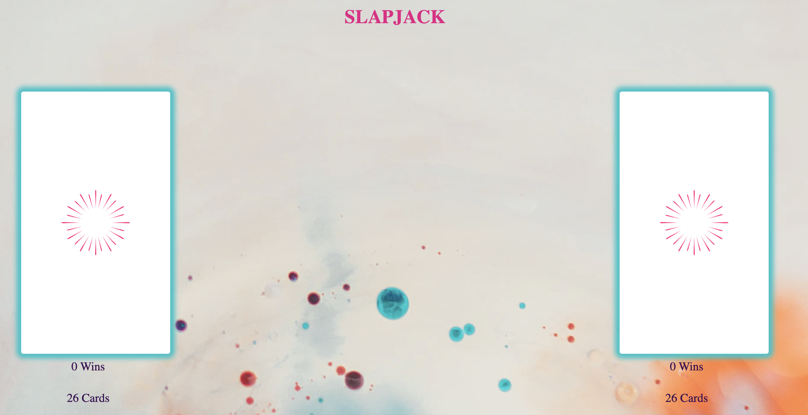
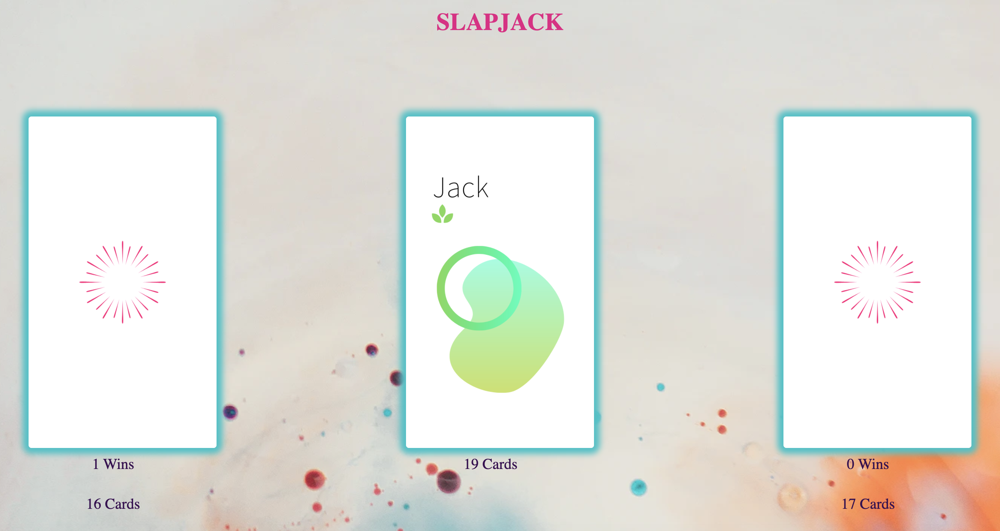
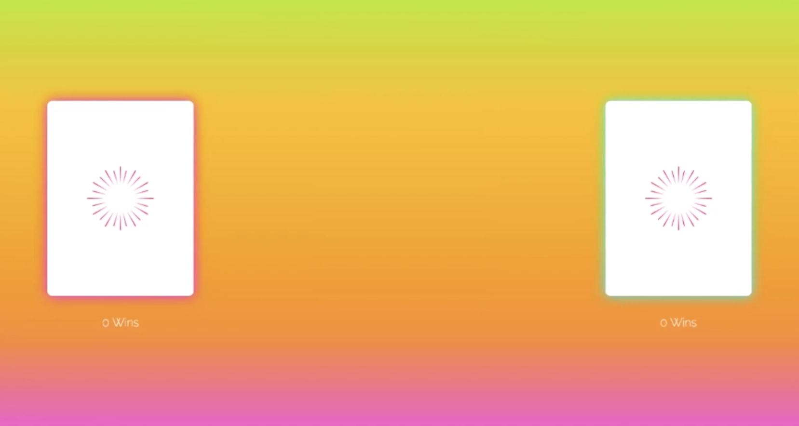
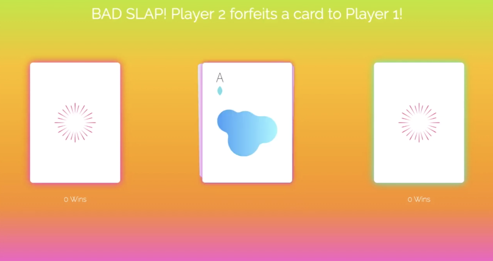
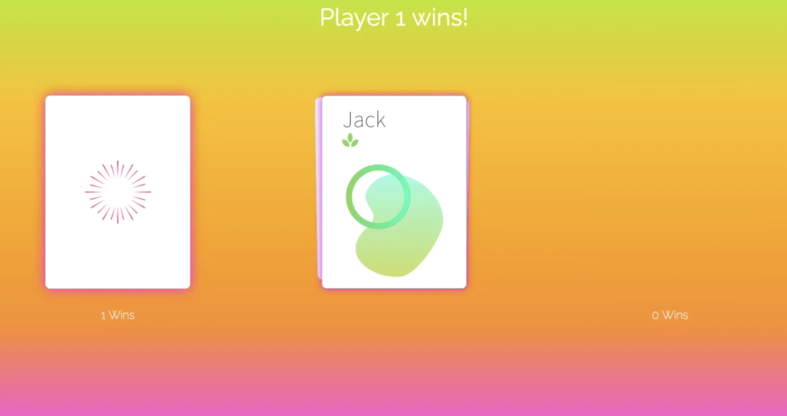

# SlapJack

**Contributors**

Katy St Sauveur

**Project Description**

This was a solo project that was designed to mimic the real life game of SlapJack. Upon window load you see two decks for two players.  You navigate your way through the game based on various different conditions, in order to end up with a player winning by having accumulated all of the cards.  Your game is controlled with keyboard presses that represent dealing a card from a players hand and slapping.  Depending upon what is happening in the game, the banner at the top will adjust to alert the players.  

**Project Goals**

* Create a functioning game with the use of HTML, CSS and JavaScript.
* Write DRY JavaScript and use event delegation for similar event listeners.
* Understand the difference between the DOM and the data model and how the data is displayed on the DOM.
* Use logic to work through many conditionals.
* Use local storage to persist the number of wins when the page refreshes.

**Challenges**

* Meeting all of the conditions for the game.
* Building the majority of the game playable without manipulating the DOM.
* Using multiple classes and knowing which class should hold what information.

**Wins**

* Limiting global variables to one instance of a game.
* Refactoring to make sure that code is dynamic.
* Created a playable game that can be extended at a later time.

**Programming Languages Used**

* HTML
* CSS
* JavaScript

**Other Important Features Implemented**

* Win display is functional
* Added a card counter so you can see how many cards are contained in each deck

## Game Screenshots

**Game Start**

**Game in Play**

## Comps Given

**Game Start View**

**Bad Slap View**

**Win View**

